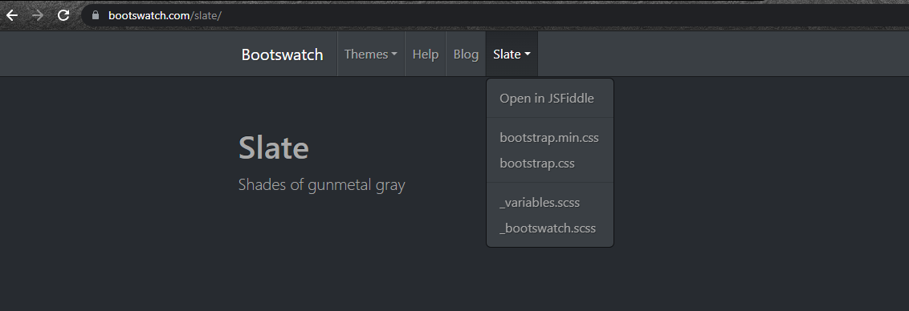

# Vue.js Appstravaganza

* What is Vue.js?
* Player Score Counter
  * Generate Simple App
    - install vue-cli if not present `npm i vue-cli -g`
    - downaload the template webpack-simple `vue init webpack-simple <project-name> `
    - As we are using webpack whenever we run it or deploy it create a single javascript file with all of our code in it
  * Add Bootswatch
    - 
  * Up Button For Player 1
  * Down Button For Player 1
  * Up Button For Player 2
  * Down Button For Player 2
* Todo App
  * Generate Simple App
  * Add Bootswatch
  * Form to add todo
    - https://getbootstrap.com/docs/4.0/components/forms/
  * Add todo to list when form submitted
    - Form always attend to submit data to somewhere to prevent this default behaviour we have to add @submit.prevent event handler
  * Show todos in a list on page
  * Click a todo to mark it as done
  * Delete button for todo
  * Watch todos for changes and save to localStorage
    - watcher: Computed properties allow us to declaratively compute derived values. However, there are cases where we need to perform "side effects" in reaction to state changes - for example, mutating the DOM, or changing another piece of state based on the result of an async operation.
    - deep watcher: watch is shallow by default: the callback will only trigger when the watched property has been assigned a new value - it won't trigger on nested property changes.
    ```
    data() {
      return {
        todo: {
          title: 'Learn Java',
          done: false
        }
      }
    },
    watch: {
      todo: {
        handler(newval, oldval){
          // make some operation on change of title or todo
        },
        deep: true
      }
    }
    ```
  * Load todos from localStorage on page load
* Reddit Client
  * Generate App with Router
    - Download full vue template with webpack and testing `vue init webpack <project name>`
    - The idea of client side routing is all of your app code still exist in one page but javascript dynamically add pages so it'll change the main content of the page using the dom manipulation to be whichever page you tell it to be thats what the `<router-view/>` does
  * Add Bootswatch
  * fetch posts from reddit
  * Add posts to page
    * Make it look kind of like reddit!
  * Add favorite button to post
  * Add favorites page to show favorites
  * Save favorites to localStorage
  * Load favorites on page load
* Movie Search
  * Generate App with Router
  * Add Bootswatch
  * Add form to search for movies by title
  * fetch movies when form submitted
  * Add movies to page
  * Click movie to go to movie page
  * Create movie route
  * fetch single movie on movie page

## Change Detection Caveats
Due to limitations in JavaScript, there are types of changes that Vue cannot detect. However, there are ways to circumvent them to preserve reactivity.

**For Objects**

Vue cannot detect property addition or deletion. Since Vue performs the getter/setter conversion process during instance initialization, a property must be present in the data object in order for Vue to convert it and make it reactive. For example:
```
var vm = new Vue({
  data: {
    a: 1
  }
})
// `vm.a` is now reactive

vm.b = 2
// `vm.b` is NOT reactive
```
Vue does not allow dynamically adding new root-level reactive properties to an already created instance. However, it’s possible to add reactive properties to a nested object using the Vue.set(object, propertyName, value) method:
```
Vue.set(vm.someObject, 'b', 2)
```
You can also use the vm.$set instance method, which is an alias to the global Vue.set:
```
this.$set(this.someObject, 'b', 2)
```